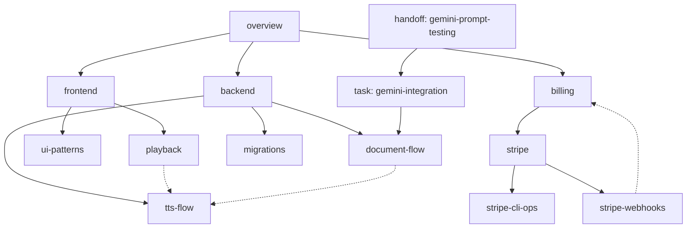

# Memex Workflow

Multi-session workflow for autonomous, long-term work on projects. Maintains intent clarity, knowledge persistence, and session continuity across days/weeks/months.

## Philosophy

**Division of labor:** Each agent focuses on its task. Meta-concerns (knowledge updates, alignment checks, session continuity) are handled by dedicated mechanisms.

**Fresh context for meta-analysis:** Agents analyzing work (`/align`, `/explain`, `/distill`, `/learnings`) run in fresh sessions. This avoids "I just wrote this" bias and sunk-cost thinking.

**Separate sessions, not sub-agents:** Workflow commands run in separate Claude Code sessions. While subagents could technically work (they have session IDs, can be resumed), separate sessions are more ergonomic for human orchestration—you can directly interact, rename, access transcripts, ask follow-ups. Currently orchestration is human; future AI orchestrators would likely also use separate sessions for similar reasons.

**Wiki-links over folders:** Hierarchy comes from intentional links, not filesystem structure. Enables small-world navigation and *progressive disclosure*.

**Analysis before questions:** When using AskUserQuestion, do 90% of the thinking first. Analyze options, evaluate trade-offs, form a recommendation. Present full reasoning. Only then ask what you genuinely need to know. Questions should emerge from analysis, not replace it.

**Trust but verify:** The goal is autonomous agents with lightweight verification. The Stop hook catches drift automatically. `/align` is for when you want deeper verification.

## The Three-Way Split

| Type | Location | Purpose | Lifetime |
|------|----------|---------|----------|
| **Tasks** | `agent/tasks/` | Intent, goals, assumptions, decisions | ~Days |
| **Handoffs** | `agent/handoffs/` | Session continuation state | Hours to a day |
| **Knowledge** | `agent/knowledge/` | Persistent docs, references, workflows, ... | Ongoing |

**Tasks** capture what the user wants, not what was implemented. Code is the implementation. Git is the history.

**Handoffs** capture session state for another agent to continue. Created at end of session via `/handoff`. Marked `consumed: true` after pickup.

**Knowledge** documents how things work. Updated via periodic `/distill`, not per-session. Based on code ground truth.

Both handoffs and tasks are still kept for historical reasoning trails, but knowledge is the continually refined long-term reference on project architecture, decisions, patterns, workflows, etc.

## Commands

| Command | Purpose | Context | When to use |
|---------|---------|---------|-------------|
| `/task [name]` | Capture/continue work on intent | Current session | Starting work, capturing thoughts/TODOs |
| `/handoff [purpose]` | Create session continuation | Current session | End of session when work continues |
| `/pickup [slug]` | Resume from handoff | Current session | Starting session to continue prior work |
| `/distill [scope]` | Periodic knowledge update from code | Fresh session | Periodically (every 3-10 commits) |
| `/learnings [session]` | Extract learnings from a session | Fresh session | After sessions with discoveries/gotchas/workflow patterns |
| `/align [session]` | Deep intent verification | Fresh session | Before major decisions, when uncertain |
| `/explain [scope]` | Code change explanation | Fresh session | Understanding changes you didn't write |

**Session-dependent:** `/align` and `/learnings` require a named session (use `/session-name` + `/rename` first).

### Command Visibility

Most commands have `disable-model-invocation: true`—user-orchestrated, not auto-invoked by agents.

**Exception:** `/handoff` is agent-visible. An agent can decide "I should hand off now."

## Hooks

**Stop hook:** Alignment check after agent responses. Uses a fresh Claude instance (via `claude -p` headless mode) to avoid sunk-cost bias. Fires every N stops to limit overhead. Blocks with clarifying questions if drift detected.

## When to Use What

**Starting new work:** `/task` to capture intent, then implement.

**Ending a session:** `/handoff` if work continues, otherwise just stop.

**Resuming work:** `/pickup` to continue from handoff.

**Periodic maintenance:** `/distill` every 5-10 commits to sync knowledge with code.

**After productive sessions:** `/learnings` to extract gotchas, patterns, discoveries.

**Uncertain about direction:** `/align` for thorough intent verification.

**Understanding changes:** `/explain` when reviewing code you didn't write.

## Why Fresh Context Matters

The working agent has:
- Sunk cost in their approach
- "I just wrote this" bias
- Tunnel vision from deep focus

Fresh agents can:
- Challenge assumptions objectively
- Spot drift from original intent
- Evaluate code without defending it

This is why `/align`, `/explain`, `/distill`, and `/learnings` should run in fresh sessions.

## Distill Frequency

Run `/distill` regularly — every 5-10 commits depending on size. Benefits of batching:
- Averages out noise from individual commits
- More holistic view of changes
- Prevents overfitting knowledge to transient WIP

Don't sweep too frequently (per-session) or too rarely (knowledge drifts from code; difficult to update).

## Wiki-Link Structure

Example structure (not a tree — a graph with cross-links):

**Link directions:**
- Tasks → Knowledge (bottom-up: task references what it needs)
- Handoffs → Tasks (handoff belongs to a task)
- Knowledge ↔ Knowledge (cross-links create small-world topology)
- Knowledge → Tasks (for historical reasoning trails, important brainstorming/planning/decision-heavy tasks)

Files can be reached from multiple paths. That's the point — not rigid hierarchy.

## Future: Agent Orchestration

Currently, orchestration is human. You decide when to `/align`, when to `/handoff`, when to spawn parallel sessions.

With headless mode (`claude -p`) and session IDs (`--resume`), an orchestrating agent could manage sessions like a human does:
- Launch work sessions with specific tasks
- Monitor progress via session transcripts
- Invoke alignment checks
- Coordinate handoffs between sessions

The commands work the same whether invoked by human or orchestrator.
