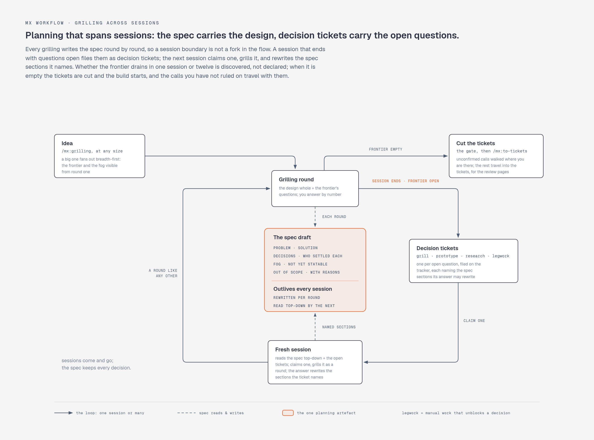
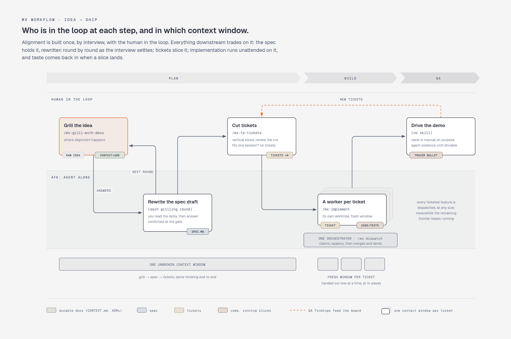

# mx: Agent Workflow Plugin

File-based specs and tickets, domain glossary + ADRs, research artefacts, and session continuity for multi-session work.

<picture>
  <source media="(prefers-color-scheme: dark)" srcset="assets/full-cycle.png">
  
</picture>

## Artefacts

| Object            | Location                             | Lifecycle                                                             | Content                                                                                                                                                             |
| ----------------- | ------------------------------------ | --------------------------------------------------------------------- | ------------------------------------------------------------------------------------------------------------------------------------------------------------------- |
| Glossary          | `CONTEXT.md` (repo root)             | durable, edited in place                                              | domain terminology, opinionated, with avoid-lists                                                                                                                   |
| ADR               | `decisions/NNNN-slug.md`             | durable, append-only                                                  | one hard-to-reverse decision and why                                                                                                                                |
| Spec              | `agent/tickets/<feature>/spec.md`    | draft while grilling, confirmed at the gate; `git rm -r` when shipped | the design: the work order for one feature                                                                                                                          |
| Ticket            | `agent/tickets/<feature>/NN-slug.md` | `proposed` while an agent's, until you rule; retired with its feature | one vertical slice with blocked-by edges, or, with `type: research | prototype | grilling | legwork`, a decision ticket: a decision to make, answered on resolution |
| Standalone ticket | `agent/tickets/<slug>.md`            | deleted when done                                                     | a ticket with no spec: no design round needed, or a decision ticket for later                                                                                       |
| Board             | `agent/board.html`                   | gitignored, re-rendered on every tracker change                       | the whole tracker as one page: features with spec status, dependency graphs, frontier, review-page links                                                            |
| Research          | `agent/research/NN-slug.md`          | gitignored, ephemeral                                                 | one question, cited findings                                                                                                                                        |
| Prototype         | `agent/prototypes/<slug>/`           | committed, kept                                                       | code that answered a design question + `ANSWER.md`                                                                                                                  |
| Show              | `agent/show/<slug>/`                 | committed once approved                                               | an explanation carried by an artefact                                                                                                                               |

`/mx:tracker` defines the file conventions (status, blocked-by, frontier, claiming, the board); the tracker lives in the repo, or in a workspace repo when features span repos.

## The main flow: idea → ship

`/mx:grill-with-docs` (relentless interview; each round delivers the design whole and writes it to the spec; glossary terms and ADRs land as residue) → `/mx:to-tickets` (tracer-bullet vertical slices with blocking edges) → `/mx:dispatch` works the tickets: a fresh `/mx:implement` per ticket (testing inside, code-review at the end), serial or in waves, the board as the standing view. A feature without tickets is built by the session that grilled it, from the confirmed spec.

**`/mx:orient` is the map**: the main flow, its on-ramps, and when to reach for what.

Planning that outgrows one session keeps its artefacts: the open questions leave as decision tickets, the next session claims one and grills it, and the spec grows until the gate confirms it:

<picture>
  <source media="(prefers-color-scheme: dark)" srcset="assets/session-boundary.png">
  
</picture>

## What's manual, what's AFK, and why

<picture>
  <source media="(prefers-color-scheme: dark)" srcset="assets/main-flow.png">
  
</picture>

- **Grilling is where alignment happens**: human in the loop, non-negotiable. Everything downstream trades on the shared understanding built there. External inputs (a meeting transcript, a client brief, a bug report) enter the flow here: grill through their unstated assumptions.
- **Plan in one window, respect the smart zone.** Grilling (which writes the spec) → tickets stays in one unbroken context window; but reasoning degrades noticeably from roughly 30% of the window used, regardless of advertised size. Approaching the limit mid-planning → end the session with the frontier open (the sharp questions become decision tickets) or handoff to a fresh thread; don't push on degraded.
- **The spec is reviewed as it is written.** A wrong line of code is one wrong line; a wrong line in a spec becomes hundreds of them, so the spec is where a look pays most. Grilling writes it round by round and you review each round's delta as it lands (`/mx:grilling` has the mechanics); writing it down is itself a design step. A spec assembled across sessions gets one whole-document read at the gate, for drift between sessions.
- **Do review the ticket breakdown** (to-tickets quizzes you). Cheap to check, and the failure mode is easy to spot: horizontal slices (all schema, then all API, then all UI) instead of vertical ones; no feedback until the layers meet.
- **Implementation is the AFK part.** Day shift plans and cuts the tickets; night shift works the frontier, fresh context per ticket.
- **QA is where you impose taste, per landed slice.** Manual, deliberately: automate the idea, the planning, *and* the QA and you get slop. Every ticket is a tracer bullet, demoable the moment it lands; the agent announces what works and how to exercise it (the ticket's What-to-build + acceptance criteria), you drive it while the remaining frontier keeps running. Findings become new tickets with blocking edges; the board absorbs them.
- **Reviews run in fresh context.** A reviewer sharing the implementer's window reviews in the dumb zone; implement closes with code-review in clean context for a reason.
- **Feedback loops are the ceiling.** Agent output quality tracks the quality of the repo's tests and typechecks. Bad output → improve the loops, not the prompt (`/mx:improve-codebase-architecture`; deep modules: design the interface, delegate the implementation).
- **The suite is measured once per feature, not per ticket.** `make test` says the tests pass; `make harden` says what they would fail to catch: the mutants of the feature's own changes that no test notices, the changed lines nothing runs, and the changes it could not measure. Dispatch runs it when the frontier empties and the orchestrator sorts the report: what a test can pin it fixes, the rest it proposes as tickets, and you read one synthesis per feature beside the diff and rule on the proposals. Anything an agent files on its own reading is `proposed`, off the frontier until you open it. The properties the spec pinned down are built once, ahead of the slices, from the spec rather than from the code.
- **Done work gets deleted** (`git rm`). Closed tickets and specs left in the tree are doc rot steering future agents wrong; git history keeps them.

## Skills & commands

| | |
| --- | --- |
| `/mx:orient` | the router; start here |
| `/mx:grill-with-docs`, `/mx:grilling` | sharpen a plan by interview; the design lands in the spec as it settles |
| `/mx:domain-modelling`, `/mx:codebase-design` | vocabulary layers: domain language + ADRs, deep-module design |
| `/mx:to-tickets` | spec → tracer-bullet tickets |
| `/mx:implement`, `/mx:testing`, `/mx:code-review` | work a ticket; what makes a test worth keeping, and `make harden`; four-axis review |
| `/mx:dispatch` | work a feature's tickets: one orchestrator, a fresh implement per ticket, serial or in waves |
| `/mx:prototype` | throwaway code to answer a design question |
| `/mx:to-questionnaire` | turn a decision someone else must answer into a questionnaire for them |
| `/mx:wizard` | bash wizard walking a human through steps only they can do (credentials, dashboards, migrations) |
| `/mx:wait-what` | that didn't land; re-pitch it in plain language |
| `/mx:show` | show, don't tell; explain via artifact (diagram, comparison, demo, explainer page, …) |
| `/mx:fork` | delegate to an agent that inherits the full conversation |
| `/mx:diagnosing-bugs` | tight-loop debugging for hard bugs |
| `/mx:improve-codebase-architecture`, `/mx:bloat-audit` | codebase health |
| `/mx:research` | primary-source investigation → cited artefact |
| `/mx:codex` | second opinion from a different model |
| `/mx:handoff`, `/mx:transcript`, `/mx:recap` | session continuity & status |
| `/mx:writing-for-agents`, `/mx:writing-for-humans` | the writing references: documents that instruct agents (skills, CLAUDE.md, specs, tickets) / artifact text read cold (docs, comments, UI copy) |

Plus assorted utilities: `tmux`, `mermaid`, `tyro-cli`, `uv-script`, `project-setup`, `ml`, `session-name`, `restore-sessions`, `permissions-review`, `review-pr`, `pr-tldr`, `overview`, `changelog`, `dependabot-triage`.

---

**Local development:**

```bash
rm -rf ~/.claude/plugins/cache/MaxWolf-01/mx/0.1.0
ln -s /path/to/mx ~/.claude/plugins/cache/MaxWolf-01/mx/0.1.0
```

`claude plugin update mx@MaxWolf-01` replaces the symlink.
