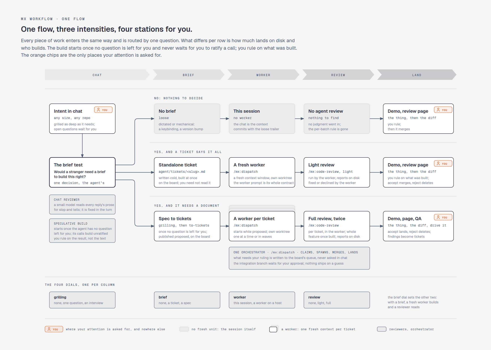
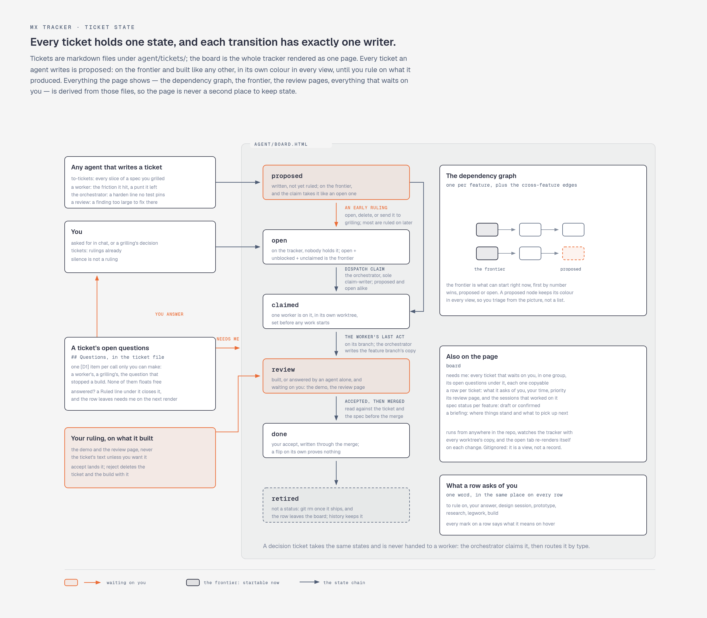
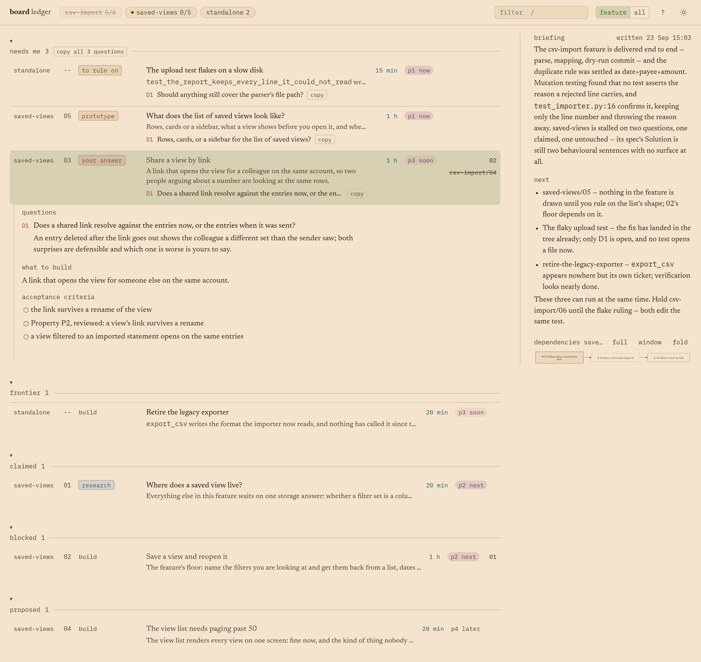
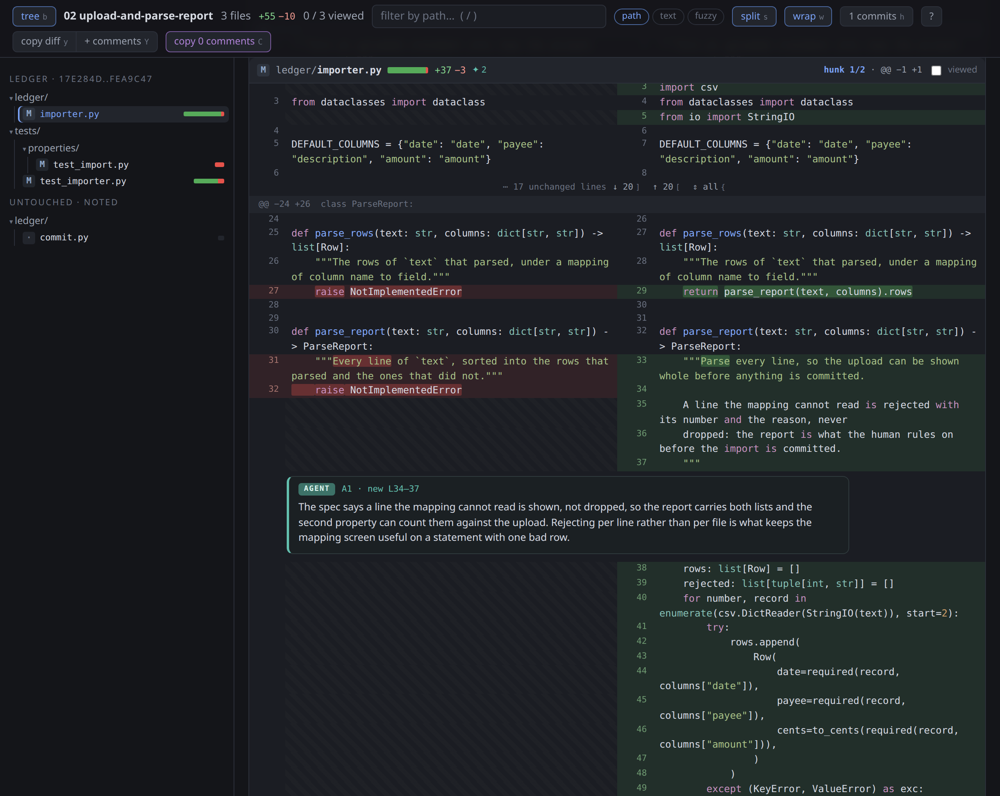
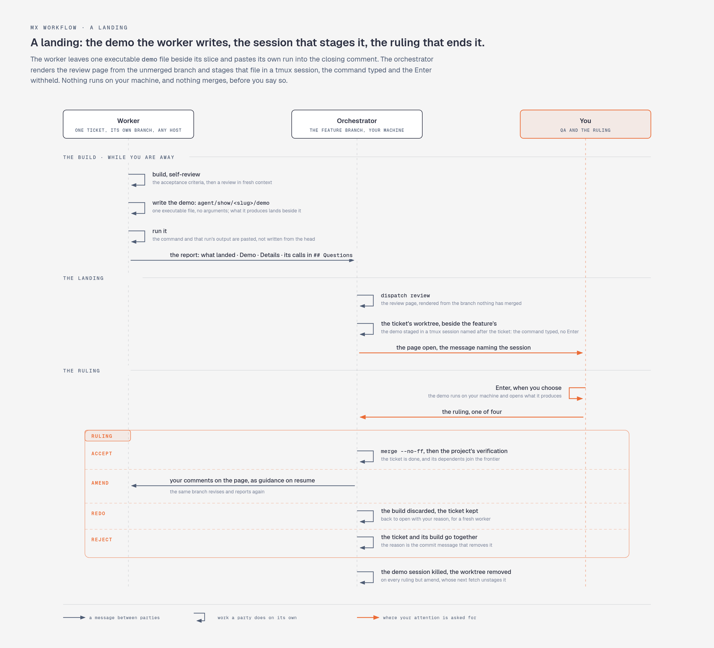

# mx: Agent Workflow Plugin

File-based tickets, domain glossary + ADRs, research artefacts, and session continuity for multi-session work.

<picture>
  <source media="(prefers-color-scheme: dark)" srcset="assets/one-flow.png">
  
</picture>

<details>
<summary><b>The whole cycle, from an intent to shipped work</b></summary>

<picture>
  <source media="(prefers-color-scheme: dark)" srcset="assets/full-cycle.png">
  
</picture>

</details>

<details>
<summary><b>Every ticket holds one state, and each transition has exactly one writer</b></summary>

<picture>
  <source media="(prefers-color-scheme: dark)" srcset="assets/ticket-state.png">
  
</picture>

</details>

<details>
<summary><b>Planning that spans sessions: the ticket carries the design, child tickets carry the open questions</b></summary>

<picture>
  <source media="(prefers-color-scheme: dark)" srcset="assets/session-boundary.png">
  
</picture>

</details>

<details>
<summary><b>The board: the tracker as one page</b></summary>

`board`, run from anywhere in the repo, renders every ticket as a row in the group of its state, and everything that waits on you in one group at the top, with its open questions under the row and a copy button on each. A row says what it asks of you, how much of your time it wants and how much it matters, every mark explaining itself on hover, and it opens to the ticket's brief, its questions and its acceptance criteria. A chip hides a whole tree of tickets, a filter narrows the rows, and the column beside them carries a briefing, where things stand and what to pick up next, written by a model that has read the repo, over a preview of the dependency graph that opens full size. An opened ticket also lists the sessions that committed on it, each with the command that resumes it, read off the `Session:` trailer a session's commits carry where a `prepare-commit-msg` hook writes one; a GitHub reference on a row says whether its pull request is open, merged or waiting on changes. It watches the tracker and the open tab re-renders itself, so it stays current while the work is in flight. Screenshots of a demo tracker, rebuilt by [`docs/figures/board-fixture/build.py`](../docs/figures/board-fixture/build.py).

<picture>
  <source media="(prefers-color-scheme: dark)" srcset="assets/board-overview.png">
  
</picture>

One tree of tickets, the other hidden by its chip; a ticket opened to its brief, its question and its criteria, and the tree's graph beside the rows:

<picture>
  <source media="(prefers-color-scheme: dark)" srcset="assets/board-feature.png">
  
</picture>

</details>

<details>
<summary><b>A ticket's review page: the diff, with the agent's reasoning on the lines it concerns</b></summary>

Every landed ticket gets one, rendered by `dispatch review` and linked from its row on the board: side-by-side diff, keyboard-driven, comments you leave export as markdown to paste back to the agent that wrote the code. The agent's own notes arrive on the page as `AGENT` blocks, anchored to the lines they explain, including on a file the diff left alone deliberately.



</details>

<details>
<summary><b>A landing: the demo the worker writes, the session that stages it, the ruling that ends it</b></summary>

Every ticket's demo is at the same path, `agent/show/<slug>/demo`, so `fd -t x '^demo$' agent/show` finds each one a week later, with no comment to read first.

<picture>
  <source media="(prefers-color-scheme: dark)" srcset="assets/landing.png">
  
</picture>

</details>

## Artefacts

| Object            | Location                             | Lifecycle                                                             | Content                                                                                                                                                             |
| ----------------- | ------------------------------------ | --------------------------------------------------------------------- | ------------------------------------------------------------------------------------------------------------------------------------------------------------------- |
| Glossary          | `CONTEXT.md` (repo root)             | durable, edited in place                                              | domain terminology, opinionated, with avoid-lists                                                                                                                   |
| ADR               | `decisions/NNNN-slug.md`             | durable, append-only                                                  | one hard-to-reverse decision and why                                                                                                                                |
| Ticket            | `agent/tickets/<slug>.md`            | `proposed` while it waits for your ruling, and built while it waits; retired once its work has shipped | one piece of work: its brief, blocking edges and acceptance criteria, plus whatever design it holds. `parent:` makes it the child of another, and a worker reads it with every ancestor |
| Board             | `agent/board.html`                   | gitignored, re-rendered on every tracker change                       | the whole tracker as one page: the needs-me group with its questions, the trees, dependency graphs, frontier, the briefing, review-page links       |
| Research          | `agent/research/NN-slug.md`          | gitignored, ephemeral; moved out of the tree when the tickets citing it retire | detail too long for the ticket that asked, cited                                                                                                                    |
| Prototype         | `agent/prototypes/<slug>/`           | committed; retired with the work it served                            | code that answered a design question + `ANSWER.md`                                                                                                                  |
| Show              | `agent/show/<slug>/`, `<branch>/`    | committed with the round or the landing that made it; retired with the ticket or branch it served | an explanation carried by an artefact                                                                                                                               |

`/mx:tracker` defines the file conventions (status, blocked-by, frontier, claiming, the board); the tracker lives in the repo, or in a workspace repo when the work spans repos.

## The main flow: intent → ship

`/mx:grill-with-docs` (relentless interview; each round delivers the design whole and writes it to the ticket; glossary terms and ADRs land as residue) → the cut into child tickets (tracer-bullet vertical slices with blocking edges, as soon as the interview has no question left for you; `/mx:tracker`) → `/mx:dispatch` works them: a fresh worker per ticket, its contract the prompt dispatch appends to it (testing inside, code-review at the end), serial or in waves, the board as the standing view. Work that is one slice stays one ticket and is dispatched as it is.

**`/mx:orient` is the map**: the question that routes an intent to loose work or a ticket, the main flow, its on-ramps, and when to reach for what.

Planning that outgrows one session keeps its artefacts: the open questions leave as child tickets that need you, the next session claims one and grills it, and the ticket grows until its frontier is empty.

## What's manual, what's AFK, and why

- **Grilling is where alignment happens**: human in the loop, non-negotiable. Everything downstream trades on the shared understanding built there. External inputs (a meeting transcript, a client brief, a bug report) enter the flow here: grill through their unstated assumptions.
- **Plan in one window, respect the smart zone.** Grilling (which writes the ticket) → the cut into child tickets stays in one unbroken context window; but reasoning degrades noticeably from roughly 30% of the window used, regardless of advertised size. Approaching the limit mid-planning → end the session with the frontier open (the sharp questions become child tickets that need you) or handoff to a fresh thread; don't push on degraded.
- **The design is reviewed as it is written.** A wrong line of code is one wrong line; a wrong line in the design becomes hundreds of them, so the ticket is where a look pays most. Grilling writes it round by round and you review each round's delta as it lands (`/mx:grilling` has the mechanics); writing it down is itself a design step. A ticket assembled across sessions gets one whole-document read before it is cut, for drift between sessions.
- **The ticket breakdown is yours to look over while it builds.** The cut files the slices `proposed` and shows them on the board, and the workers start. The failure mode is easy to spot from the graph: horizontal slices (all schema, then all API, then all UI) instead of vertical ones, no feedback until the layers meet. You rule on each slice from what it built, which is where a slice too coarse to demo shows up anyway.
- **The build runs while you are away.** It starts when the interview has no question left for you; every call you have not ruled on travels into the tickets as an anchored assumption and waits for you on the review page. Each build waits on its own branch for your ruling (accept, amend, redo or reject): nothing merges before you rule, and a ticket's dependents start only after you accept it.
- **Implementation is the AFK part.** Day shift plans and cuts the tickets; night shift works the frontier, fresh context per ticket.
- **QA is where you impose taste, per landed slice.** Manual, deliberately: automate the idea, the planning, *and* the QA and you get slop. Every ticket is a tracer bullet, demoable the moment it lands: the worker leaves one executable `demo` file beside its slice and pastes its own run of it into the closing comment, `dispatch review` stages that file in a tmux session named after the ticket with the command typed and the Enter left to you, and you drive it beside the review page while the remaining frontier keeps running. Findings become new tickets with blocking edges; the board absorbs them.
- **Reviews run in fresh context.** A reviewer sharing the implementer's window reviews in the dumb zone; a worker closes with code-review in clean context for a reason.
- **Chat replies have a reviewer too.** Every session with the plugin runs a Stop hook: a small model reads the reply just written against the chat-scoped rules of `/mx:writing-for-humans`'s catalogue and hands the tells it finds, with the rules they break, back to the session, which weighs them and revises the reply before you act on the draft. It fails open, stays out of a dispatched worker's session, and logs every decision it makes; `CHAT_REVIEW_OFF` in the environment turns it off, and the script, `mx/skills/writing-for-humans/chat_review.py`, says where the log goes.
- **Feedback loops are the ceiling.** Agent output quality tracks the quality of the repo's tests and typechecks. Bad output → improve the loops, not the prompt (`/mx:improve-codebase-architecture`; deep modules: design the interface, delegate the implementation).
- **The suite is measured once per tree, not per ticket.** `make test` says the tests pass; `make harden` says what they would fail to catch: the mutants of that tree's own changes that no test notices, the changed lines nothing runs, and the changes it could not measure. Dispatch runs it when the frontier empties and the orchestrator sorts the report: what a test can pin it fixes, the rest it proposes as tickets, and you read one debrief per tree beside the diff and rule on the proposals. Anything an agent files on its own reading is `proposed`: worked like any other ticket, and yours to rule on from what it produced. The properties the design pinned down are built once, ahead of the slices, from the ticket rather than from the code.
- **Done work gets deleted** (`git rm`). Closed tickets left in the tree are doc rot steering future agents wrong; git history keeps them.

## Skills & commands

| | |
| --- | --- |
| `/mx:orient` | the router; start here |
| `/mx:grill-with-docs`, `/mx:grilling` | sharpen a plan by interview; the design lands in the ticket as it settles |
| `/mx:domain-modelling`, `/mx:codebase-design` | vocabulary layers: domain language + ADRs, deep-module design |
| `/mx:testing`, `/mx:code-review` | what makes a test worth keeping, and `make harden`; four-axis review |
| `/mx:dispatch` | work a ticket and its children: one orchestrator, a fresh worker per ticket, serial or in waves |
| `/mx:prototype` | throwaway code when shapes are rivals or one has to be driven to be judged |
| `/mx:to-questionnaire` | turn a decision someone else must answer into a questionnaire for them |
| `/mx:wizard` | bash wizard walking a human through steps only they can do (credentials, dashboards, migrations) |
| `/mx:wait-what` | that didn't land; re-pitch it in plain language |
| `/mx:show` | show, don't tell; explain via artifact (diagram, comparison, demo, explainer page, …) |
| `/mx:fork` | delegate to an agent that inherits the full conversation |
| `/mx:diagnosing-bugs` | tight-loop debugging for hard bugs |
| `/mx:improve-codebase-architecture`, `/mx:bloat-audit` | codebase health |
| `/mx:research` | primary-source investigation → findings on the ticket that asked |
| `/mx:codex` | second opinion from a different model |
| `/mx:handoff`, `/mx:transcript`, `/mx:recap` | session continuity & status |
| `/mx:writing-for-agents`, `/mx:writing-for-humans` | the writing references: documents that instruct agents (skills, CLAUDE.md, tickets) / artifact text read cold (docs, comments, UI copy) |

Plus assorted utilities: `tmux`, `mermaid`, `tyro-cli`, `uv-script`, `project-setup`, `ml`, `house-style`, `session-name`, `restore-sessions`, `permissions-review`, `review-pr`, `pr-tldr`, `gh-stack`, `expert`, `upstream-issue`, `changelog`, `dependabot-triage`.

---

**Local development:**

```bash
rm -rf ~/.claude/plugins/cache/MaxWolf-01/mx/0.1.0
ln -s /path/to/mx ~/.claude/plugins/cache/MaxWolf-01/mx/0.1.0
```

`claude plugin update mx@MaxWolf-01` replaces the symlink.
